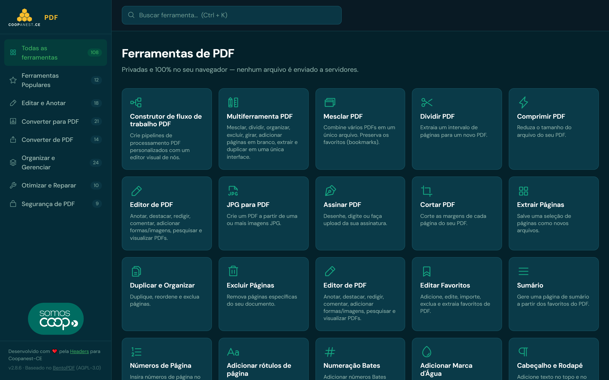
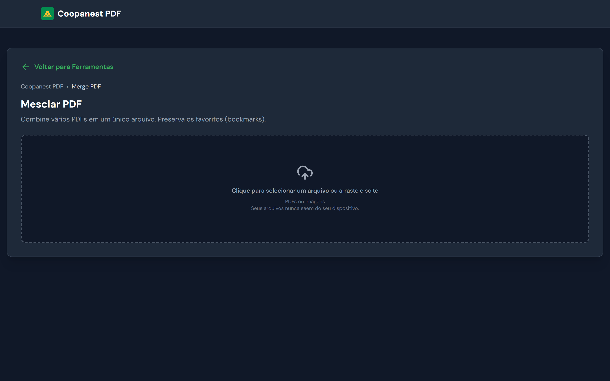
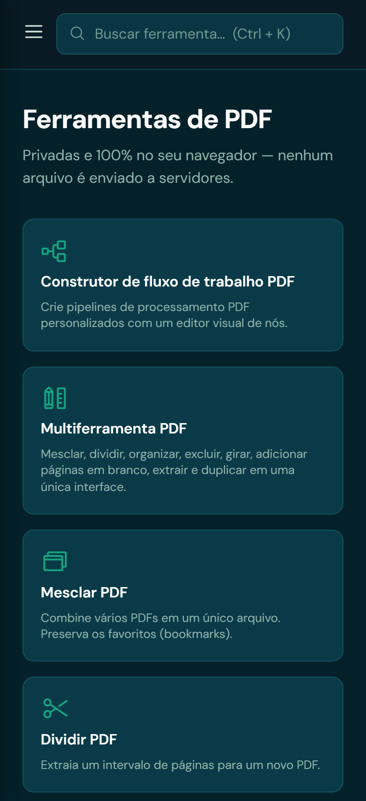

<h1 align="center">Coopanest PDF</h1>

<p align="center">
  <b>Mais de 100 ferramentas de PDF — gratuitas e 100% no seu navegador.</b><br>
  <sub>🔒 Seus arquivos <b>nunca são enviados</b> para nenhum servidor. Tudo acontece no seu próprio dispositivo.</sub>
</p>

<p align="center">
  <a href="https://pdf.coopanest-ce.com.br"><b>▶️ Acessar agora — pdf.coopanest-ce.com.br</b></a>
</p>

<p align="center">
  
  
  
  
  
</p>

<p align="center">
  
</p>

---

## 📣 Disponível gratuitamente para todos

A **Coopanest-CE** disponibiliza, sem qualquer custo, uma central completa de ferramentas de PDF:

### 👉 [**pdf.coopanest-ce.com.br**](https://pdf.coopanest-ce.com.br)

**Sem cadastro. Sem instalação. Sem limite de uso.** Basta abrir o link no navegador (computador ou celular) e usar.

> ### 🔒 Os seus arquivos ficam com você
>
> O Coopanest PDF processa **tudo dentro do seu navegador**. Nenhum documento é **enviado**, **copiado** ou **armazenado** em servidores — nem da Coopanest, nem de terceiros. Quando você fecha a aba, não sobra nada em lugar nenhum. É a mesma privacidade de um programa instalado no seu computador, só que sem instalar nada.

---

## ✨ O que dá para fazer

Mais de **100 ferramentas**, organizadas por categoria:

| Categoria                    | Exemplos                                                                   |
| ---------------------------- | -------------------------------------------------------------------------- |
| ⭐ **Populares**             | Mesclar, Dividir, Comprimir, JPG→PDF, Assinar                              |
| ✏️ **Editar e Anotar**       | Editor de PDF, Marca d'água, Carimbos, Cabeçalho/Rodapé, Números de página |
| ⬇️ **Converter para PDF**    | Imagens, Word, Excel, PowerPoint, TXT, Markdown, e-mail, XML…              |
| ⬆️ **Converter de PDF**      | PDF→JPG/PNG, PDF→Word/Excel, PDF→Texto, PDF→Markdown…                      |
| 🗂️ **Organizar e Gerenciar** | Reordenar, Extrair/Excluir páginas, Girar, Favoritos, Sumário              |
| 🔧 **Otimizar e Reparar**    | Comprimir, Reparar, Linearizar, Remover metadados                          |
| 🔒 **Segurança de PDF**      | Proteger/Remover senha, Assinar digitalmente, Carimbo do tempo, Sanitizar  |

Também há **OCR** (reconhecimento de texto em documentos escaneados) em português e inglês, e um **construtor de fluxos** para encadear várias operações de uma vez — **tudo rodando localmente no navegador.**

---

## 🖥️ As telas

**Página inicial** — todas as ferramentas em um só lugar, com busca rápida (`Ctrl + K`):

<p align="center">
  
</p>

<table>
  <tr>
    <td width="58%" valign="top">
      <b>Cada ferramenta reforça a privacidade</b><br>
      <sub>Ao abrir qualquer ferramenta, a própria interface avisa: <i>"Seus arquivos nunca saem do seu dispositivo."</i></sub><br><br>
      
    </td>
    <td width="42%" valign="top">
      <b>Funciona no celular</b><br>
      <sub>Layout responsivo — mesma central de ferramentas na palma da mão.</sub><br><br>
      
    </td>
  </tr>
</table>

---

## 🏢 Para a cooperativa: personalização (white-label)

**Este repositório existe para que a cooperativa possa deixar o sistema com a sua própria cara** — cores, logo e identidade visual próprios — caso deseje hospedar a sua versão.

> **Só quer usar as ferramentas?** Você não precisa de nada disto — é só acessar **[pdf.coopanest-ce.com.br](https://pdf.coopanest-ce.com.br)**. Este código é destinado a quem vai **customizar e hospedar** o sistema.

O que dá para personalizar via variáveis de build (sem mexer no código):

| Variável                | O que faz                             |
| ----------------------- | ------------------------------------- |
| `VITE_BRAND_NAME`       | Nome exibido (ex.: `"Coopanest PDF"`) |
| `VITE_BRAND_LOGO`       | Caminho do logo/símbolo               |
| `VITE_FOOTER_TEXT`      | Texto do rodapé                       |
| `VITE_DEFAULT_LANGUAGE` | Idioma padrão (`pt`)                  |
| `DISABLE_TOOLS`         | Lista de ferramentas a ocultar        |
| `SITE_URL`              | Domínio de produção                   |

As **cores** ficam em [`src/css/styles.css`](src/css/styles.css) (paleta verde/amarelo/teal da Coopanest) e os **logos/favicons** em [`public/images/`](public/images/). Trocando esses arquivos e as variáveis acima, o sistema assume outra identidade visual.

### Rodar localmente

```bash
npm install
npm run dev       # ambiente de desenvolvimento
npm run build     # build de produção (arquivos estáticos)
```

### Deploy com Docker

```bash
# produção
docker compose -f docker-compose.prod.yml up -d --build
# homologação
docker compose -f docker-compose.homolog.yml up -d --build
```

> **Modo air-gap (sem depender de CDNs):** os componentes de processamento (WASM/OCR/fontes) podem ser servidos pelo próprio domínio. Gere os pacotes com `scripts/prepare-airgap.sh` antes do build. Esses artefatos **não** ficam versionados aqui (são grandes e regeneráveis).

---

## 🧩 Como funciona (arquitetura)

- **100% client-side:** todo o processamento roda no navegador via **WebAssembly** (PyMuPDF, Ghostscript, CoherentPDF) e **OCR** (Tesseract). **Não há back-end que receba arquivos.**
- **Sem upload, sem banco de dados, sem rastreamento:** nenhum cookie de rastreio, nenhuma telemetria, nenhum analytics de terceiros.
- **Air-gap / origem própria:** a versão publicada não busca recursos em CDNs externas — política de segurança (CSP) restrita à própria origem.
- **Interface em português (PT-BR).**

Essa arquitetura é o que garante a promessa central: **os documentos nunca deixam o dispositivo de quem usa.**

---

## 📢 Texto pronto para divulgar

Copie e cole (WhatsApp, e-mail, redes):

```text
📄 A Coopanest-CE tem uma central de ferramentas de PDF — GRATUITA!

Mesclar, dividir, comprimir, converter, assinar, OCR e muito mais,
em um só lugar e sem custo nenhum.

🔒 Seguro de verdade: seus arquivos NÃO são enviados para nenhum
servidor. Tudo acontece dentro do seu navegador, no seu dispositivo.

👉 Acesse: https://pdf.coopanest-ce.com.br

Sem cadastro, sem instalação, sem limite. Funciona no celular também.
```

---

## 📄 Licença e créditos

Distribuído sob a **[AGPL-3.0](LICENSE)**.

O Coopanest PDF é um trabalho derivado do **[BentoPDF](https://github.com/alam00000/bentopdf)** (também AGPL-3.0), com interface em português, identidade visual da Coopanest-CE e configuração para operação com origem própria. Nosso agradecimento ao projeto e à comunidade originais.

<p align="center"><sub>Desenvolvido com ❤️ pela <a href="https://headers.com.br">Headers</a> para a Coopanest-CE · O selo <b>SomosCoop</b> é marca do Sistema OCB.</sub></p>
